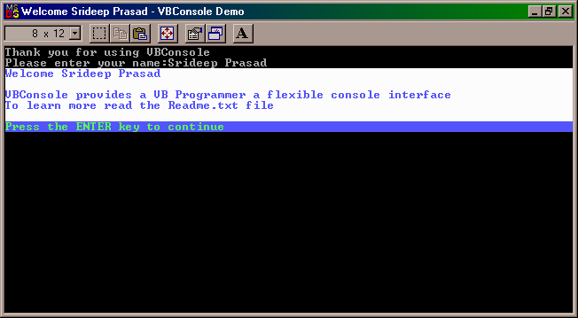



## VB \- Console v2\.0

### Description

VBConsole is a versatile ActiveX Dll that enables VB programmers to write powerful "true" Console apps.VBConsole packs the complicated console API into a simple and easy to use interface thus allowing even a beginner to take advantage of this versatile control

And of course, Your vote will be appreciated !
 
### More Info
 
NOTE: As far as possible, do not attempt to forcefully terminate an active console within the IDE

             |
---                |---
**Submitted On**   |2001-06-27 07:22:18
**By**             |[Srideep Prasad](https://github.com/Planet-Source-Code/PSCIndex/blob/master/ByAuthor/srideep-prasad.md)
**Level**          |Advanced
**User Rating**    |4.8 (29 globes from 6 users)
**Compatibility**  |VB 4\.0 \(32\-bit\), VB 5\.0, VB 6\.0, VBA MS Access, VBA MS Excel
**Category**       |[VB function enhancement](https://github.com/Planet-Source-Code/PSCIndex/blob/master/ByCategory/vb-function-enhancement__1-25.md)
**World**          |[Visual Basic](https://github.com/Planet-Source-Code/PSCIndex/blob/master/ByWorld/visual-basic.md)
**Archive File**   |[VBConsole 217536262001\.zip](https://github.com/Planet-Source-Code/srideep-prasad-vb-console-v2-0__1-24474/archive/master.zip)

